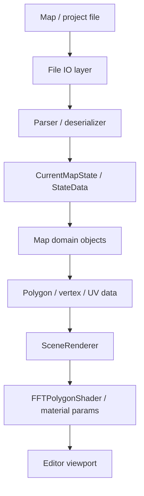

# Map Loading Pipeline - Working Draft



## Three.js rebuild target

```text
File
  -> ArrayBuffer / DataView reader
  -> TypeScript parser
  -> MapDocument
  -> PolygonModel[] / TexturePage[] / Palette[]
  -> THREE.BufferGeometry
  -> ShaderMaterial uniforms
  -> WebGL viewport
```

## Investigation checklist

- Identify exact file readers/writers.
- Identify canonical in-memory map state type.
- Identify polygon/vertex ownership.
- Identify texture/palette ownership.
- Identify UV animation ownership.
- Identify save/export path.
